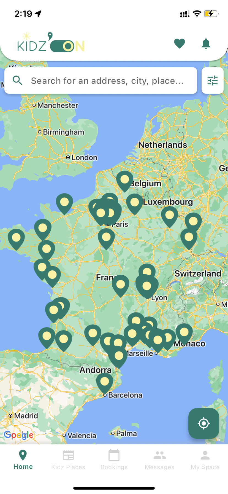
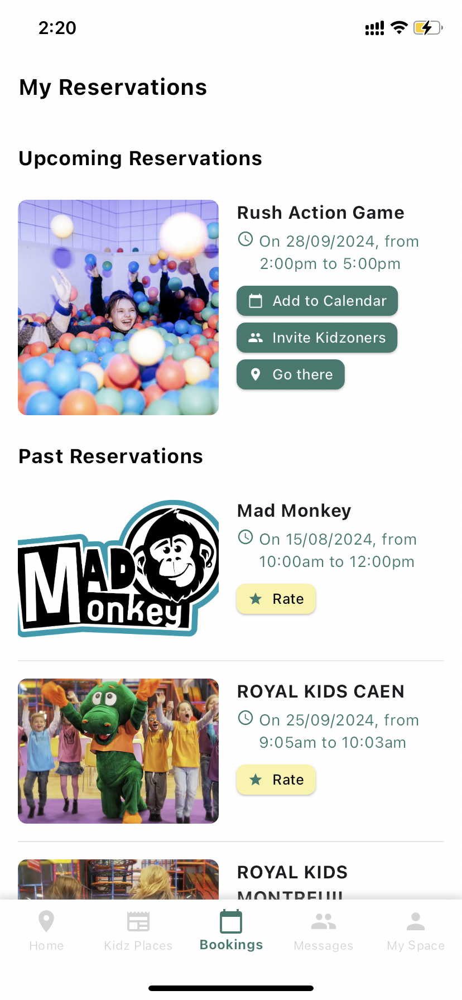
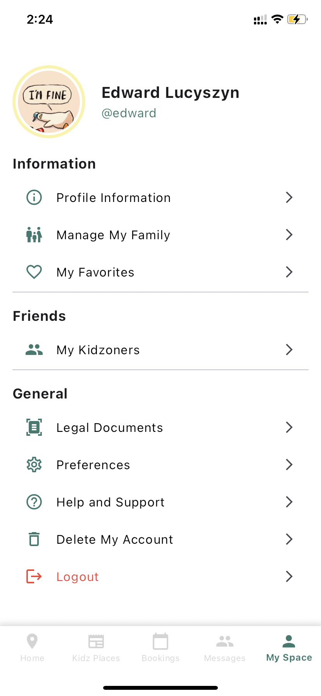
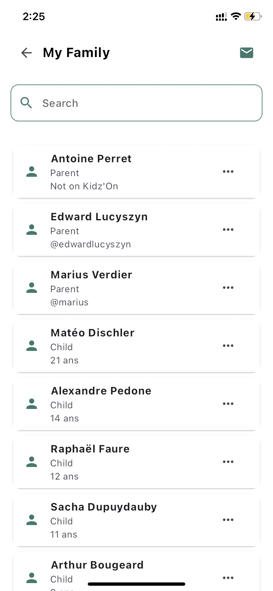

# Hi there 👋, I'm Edward
### I am a student at Columbia University

Passionate about mathematics and computer science from an early age, I pursued scientific preparatory classes at Lycée Carnot before joining CentraleSupélec, one of the top engineering schools in France and part of the Université Paris-Saclay. During my two years at CentraleSupélec, I pursued a Master of Science in Engineering, specializing in finance and probabilities, taking courses in stochastic finance, risk modeling, optimization, and machine learning.

I have been involved in various practical projects, including implementing and optimizing investment strategies with BNP Paribas Asset Management and analyzing financial markets. Additionally, I conducted a research study in mathematics to reduce acoustic pollution from aircraft engines and created a mobile application from scratch for a Junior Enterprise project.

I am currently pursuing a Master of Science in Management Science and Engineering at Columbia University, taking courses such as Data-Driven Methods in finance and optimization models.

I am actively seeking a summer internship in quant research or software engineering.

### Skills
- Python (very advacned
- SQL
- LaTeX
- Git and server administration
- Dart
- React Native

---

# My Projects

## Stochastic Finance Risk Modeling Project - Feb to Apr 2024 (see [here](https://github.com/edward-lucyszyn/portfolio-optimization))

As part of my coursework at CentraleSupélec, I worked on a project that aimed to optimize an investment portfolio using financial data. With a team, we applied **Markowitz's portfolio theory** to maximize returns while minimizing risk, analyzing data from the S&P 500. We evaluated risk through measures such as **Expected Shortfall** and **Entropic Value at Risk**. Our findings provided insights into managing risk under extreme market conditions. This project was carried out in collaboration with **BNP Paribas Asset Management**.

## Kidz'On Application - Mar 2024 to Sep 2024 (private repo)

  
  
  
  

**Kidz'On** is an app designed to easily offer family activities, especially for children, close to your location! I developed the app **from scratch**, implementing **features such as user management, synchronized family accounts, nearby activity search, interactive map, automatic translation, authentication, and messaging**. The data comes from the website [kidzon.fr](kidzon.fr), which was created by a friend I partnered with for this mission. On the website, businesses can register their locations and activities. We also **set up the database, messaging system, and all backend features together**.

## Acoustical Pollution Control Optimization Project - Nov 2023 (see [here](https://github.com/edward-lucyszyn/acoustic-optimization-problem))

  
  
  
  

This five-days project focuses on reducing noise in environments such as aircraft reactors by optimizing the distribution of sound-absorbing materials. Using finite difference methods to solve the Helmholtz equation, we implemented a gradient descent optimization algorithm to find the best material placement for minimizing energy across a range of frequencies. The project involved both numerical and theoretical analyses, exploring fractal geometries and material efficiency.

Our findings demonstrated significant noise reduction using optimized fractal surfaces, leading to improved sound attenuation and material efficiency.

## Pylos AI - Dec 2022 (see [here](https://github.com/edward-lucyszyn/algorithm-for-pylos))

For the course "Computational Approach to Games" at CentraleSupélec, I developed an AI player for the **Pylos** board game using the **ALPHABETA algorithm**. The project involved implementing a heuristic function to optimize the AI's strategy and improve its performance. I was awarded one of the highest grades in this project, indicating the effectiveness of the AI I developed.

---
